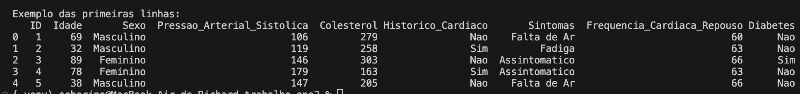

# FIAP - Faculdade de Informática e Administração Paulista

<p align="center">
<a href= "https://www.fiap.com.br/"></a>
</p>

<br>

# Ano 2 - Fase 1

## Grupo DRELL

## 👨‍🎓 Integrantes: 
- <a href="https://www.linkedin.com/in/douglas-souza-felipe-b815281a2/">Douglas</a>
- <a href="https://www.linkedin.com/in/richard-marques-26b3a14/">Richard</a>
- <a href="https://www.linkedin.com/in/lucasmedeirosleite">Lucas Medeiros</a> 
- <a href="https://www.linkedin.com/in/luis-fernando-dos-santos-costa-b69894365/">Luis</a>

## 👩‍🏫 Professores:
### Tutor(a) 
- <a href="https://github.com/leoruiz197">Leo Ruiz</a>
### Coordenador(a)
- <a href="https://www.linkedin.com/in/andregodoichiovato/">Andre Godoi</a>


## 📜 Descrição

Este é o repositório mantém os assets solicitados para a esta primeira etapa da cosntrução de um sistema inteligente de detecção de doenças cardíacas. 

## Asset 1: Dados numéricos
O arquivo "dados_pacientes.csv" foi gerado de forma sintética com um código em Python também presente no repositório. 


O arquivo contém os seguintes dados:
- ID: Idenfificador do registro
- Idade: em anos do paciente
- Sexo: Masculino ou Feminino
- Pressão Arterial sistolica
- Colesterol
- Se o paciênte possui histórico de doenças cardiacas
- Sintomes: Falta de ar, Dor no peito, Fadiga, Assintomatico
- Frequencia cardiaca em repouso: batimentos por minuto
- Se o paciênte possui ou não diabétes: Sim ou Não

Se quiser gerar novas variações destes dados basta executar o código Python com a linha de comando abaixo:
```
# Criando e ativando um ambiente para rodar este códgio
python3 -m pip venv .venv
source .venv/bin/activate

# instala os pacotes necessários
python3 -m pip install pandas
python3 -m pip install numpy

# Executa o código para a geração do arquivo
python3 gera_dados_sinteticos.py
```

## Asset 2: Textos cientificos sobre doenças cardiacas
Na pastas "doc" estão os arquivos no formato .txt contendo os artigos abaixo:
### Mortalidade por Doenças Cardiovasculares no Brasil e na Região Metropolitana de São Paulo: Atualização 2011
Resumo: As doenças cardiovasculares (DCV) são as principais causas de morte na população brasileira. Observou-se
redução progressiva da mortalidade por tais doenças até o ano de 2005.
Objetivo: Atualizar as tendências da mortalidade das DCV no Brasil e na região metropolitana de São Paulo (RMSP) de
1990 a 2009.

Arquivo: doc/artigo1.txt
Fonte: https://www.scielo.br/j/abc/a/CLG9bTSVkjBDdG5CYsrN7By/?format=pdf&lang=pt

### Carga global da cardiopatia isquêmica atribuível a riscos dietéticos em adultos jovens
Resumo: Globalmente, em 2021, as taxas de mortalidade e de DALYs (Anos de Vida Ajustados por Incapacidade) por CI relacionadas à dieta entre adultos jovens foram de 9,48 e 465,57, respectivamente, com os homens suportando uma carga maior que as mulheres. De 1990 a 2021, tanto as taxas de mortalidade quanto as de DALYs demonstraram declínios consistentes. A região de Índice Sociodemográfico (SDI) baixo-médio e a Europa Oriental exibiram a maior carga de CI entre as cinco regiões de SDI e as 21 regiões do GBD, respectivamente. Uma dieta pobre em grãos integrais foi identificada como o principal fator de risco dietético para a carga de CI, enquanto o alto consumo de bebidas açucaradas permaneceu como o único fator de risco dietético demonstrando uma tendência de alta. As projeções sugerem que, até 2031, a taxa de mortalidade global por CI relacionada à dieta entre adultos jovens diminuirá 4,58%, enquanto a taxa de DALYs deve aumentar 0,34%.

Objetivo: A cardiopatia isquêmica (CI) está impondo uma carga global crescente sobre adultos jovens, para os quais os fatores dietéticos representam um alvo preventivo proeminente e viável. Este estudo investigou a carga global e as tendências da CI atribuível a riscos dietéticos entre adultos jovens de 1990 a 2021, com projeções até 2031.

Arquivo: doc/artigo2.txt
Fonte: https://pmc.ncbi.nlm.nih.gov/articles/PMC12945797/

## Asset 3: Imagens de exames de Eletro Cardiograma
A base de imagens de excames cardiacos foi baixado do site Kaglle, estão na pasta "assets/ECG_DATA" organizados em exemplos para treino e para teste. 
Dentro das pastas existem 4 variacoes de exemplos:
- Imagens de ECG de Pacientes com Infarto do Miocárdio
- Imagens de ECG de Pacientes com Histórico de Infarto do Miocárdio
- Imagens de ECG de Pacientes que possuem Batimentos Cardíacos Anormais
- Imagens de ECG de Pacientes com sinais normais

## 📁 Estrutura de pastas

Dentre os arquivos e pastas presentes na raiz do projeto, definem-se:

- <b>assets</b>: aqui estão os arquivos relacionados a elementos não-estruturados deste repositório, como imagens.

- <b>assets/ECG_DATA</b>: Imagens para treino de modelos de IA sobre exames de ECG

- <b>doc</b>: aqui estão todos os documentos que fazem parte da entrega dos artivos cientificos

- <b>README.md</b>: arquivo que serve como guia e explicação geral sobre o projeto (o mesmo que você está lendo agora).


## 🗃 Histórico de lançamentos

* 0.1.0 - 08/03/2026
    * Versão inicial

## 📋 Licença

<p xmlns:cc="http://creativecommons.org/ns#" xmlns:dct="http://purl.org/dc/terms/"><a property="dct:title" rel="cc:attributionURL" href="https://github.com/agodoi/template">MODELO GIT FIAP</a> por <a rel="cc:attributionURL dct:creator" property="cc:attributionName" href="https://fiap.com.br">Fiap</a> está licenciado sobre <a href="http://creativecommons.org/licenses/by/4.0/?ref=chooser-v1" target="_blank" rel="license noopener noreferrer" style="display:inline-block;">Attribution 4.0 International</a>.</p>


